# 🚀 Friendlivery - Платформа Доставки Посылок

> Объединение путешественников с пустующим местом в багаже и людей, которым нужна срочная доставка

## 📖 Оглавление
- [💡 Идея проекта](#-идея-проекта)
- [🎯 Основной функционал](#-основной-функционал)
- [💰 Экономическая модель](#-экономическая-модель)           
- [🛡️ Система безопасности](#-система-безопасности)         
- [🏗️ Архитектура](#-архитектура)
- [🛠️ Технологический стек](#-технологический-стек)
- [🚀 Быстрый старт](#-быстрый-старт)
- [📸 Демонстрация полного цикла](#-демонстрация-полного-цикла)
- [🎯 Планы по развитию](#-планы-по-развитию)


## 💡 Идея проекта

### Проблема двух сторон

**✈️ Со стороны путешественников:**
- Пассажиры авиарейсов часто летают с неполным багажом
- Включенные в билет килограммы остаются неиспользованными
- Потенциальный дополнительный доход упускается

**📦 Со стороны отправителей:**
- Срочная доставка документов и мелких грузов стоит дорого
- Традиционные курьерские службы работают медленно (3-7 дней)
- Нет гарантий безопасной и быстрой доставки

### Решение

Friendlivery создает **эффективный симбиоз** между двумя группами пользователей


## 🎯 Основной функционал

### 👤 Ролевая модель

**Курьер (Путешественник):**
- Указывает маршрут полета и даты вылета/прилета
- Определяет доступный вес и габариты багажа
- Просматривает подходящие заявки на доставку
- Выбирает заявку и связывается с отправителем
- Получает оплату после успешной доставки

**Отправитель:**
- Создает заявку с описанием груза
- Указывает аэропорты отправки и назначения
- Задает желаемые сроки доставки
- Вносит оплату через защищенную систему
- Подтверждает получение груза


## 💰 Экономическая модель

### Для пользователей

**Отправитель выигрывает:**
- 💰 **Экономия до 70%** compared to traditional couriers
- ⚡ **Скорость доставки 1-2 дня** instead of 3-7
- 🔒 **Гарантии безопасности** through airport transfers

**Курьер выигрывает:**
- 💵 **Дополнительный доход ** за рейс
- 🛄 **Полезное использование** пустующего места
- 🌍 **Помощь людям** в срочных ситуациях


## 🛡️ Система безопасности

### Гарантии для всех участников

**🔐 Финансовая безопасность:**
- Эскроу-счета для всех транзакций
- Оплата хранится до подтверждения доставки
- Прозрачная комиссия сервиса (15-20%)


**🔐 Верификация пользователей:**
- JWT аутентификация с защищенными токенами
- Авторизация на основе ролей пользователей
- Защита от неавторизованного доступа к API


## 🏗️ Архитектура

### 🎯 Backend Platform 

**🔐 Auth-Service** - Аутентификация и авторизация  

**📦 Delivery-Service** - Управление заявками на доставку  

**✈️ Flight-Service** - Маршруты курьеров и мэтчинг  

**💳 Payment-Service** - Эскроу платежи (создан mock-ЮKassa)

**💬 Chat-Service** - Коммуникация между пользователями  

**📧 Notification-Service** - Уведомления

**🚪 API-Gateway** - Единая точка входа (маршрутизатор, проверка access-токена, добавление в заголовок userId из токена)


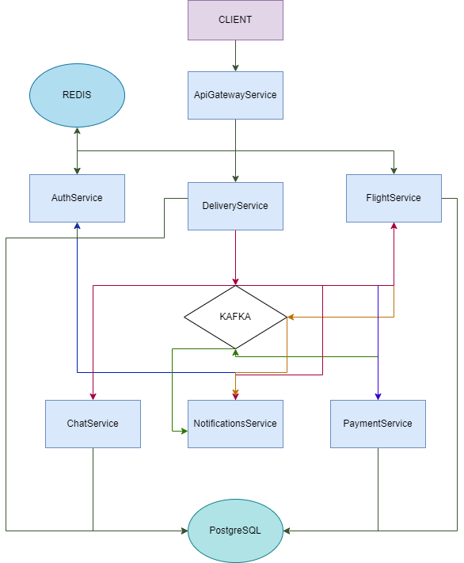

## 🛠️ Технологический стек

### Backend
- **Java 21** - основной язык программирования
- **Spring Boot 3.4.5** - фреймворк для создания микросервисов
- **Spring Security** - аутентификация и авторизация
- **Spring Data JPA** - работа с базами данных
- **Spring Kafka** - интеграция с Apache Kafka
- **Spring Web** - разработка REST API
- **Spring WebSocket** - real-time коммуникация
- **Spring Cloud OpenFeign** - декларативные HTTP клиенты для межсервисного взаимодействия
- **Maven** - управление зависимостями и сборка

### Базы данных и кэширование
- **PostgreSQL** - реляционная база данных для хранения основных данных
- **Redis** - in-memory кэш для сессий и временных данных
- **Hibernate** - ORM для работы с базой данных

### Инфраструктура и messaging
- **Docker** - контейнеризация приложений
- **Docker Compose** - оркестрация многоконтейнерных приложений
- **Apache Kafka** - event-driven архитектура и асинхронная коммуникация
- **JWT (JSON Web Tokens)** - безопасная аутентификация

### Архитектура и разработка
- **Микросервисная архитектура** - 7 независимых сервисов
- **REST API** - стандартизированные HTTP endpoints
- **Event-Driven Design** - реактивная архитектура на событиях
- **API Gateway** - единая точка входа для клиентов
- **Mockito/JUnit 5** - unit тестирование с моками

## 🚀 Быстрый старт
### Prerequisites
- Java 21
- Maven 3.6+
- Docker & Docker Compose

### Запуск:

```bash
# 1. Собрать проект
mvn clean package -DskipTests

# 2. Запустить все сервисы
docker-compose up -d
```

## 📸 Демонстрация полного цикла

*В демо показан основной бизнес-процесс. Полная функциональность включает дополнительные сценарии.*
#### 1. Регистарция и аутентификаци
#### Cначала делаем запрос на регистрацию отправителя
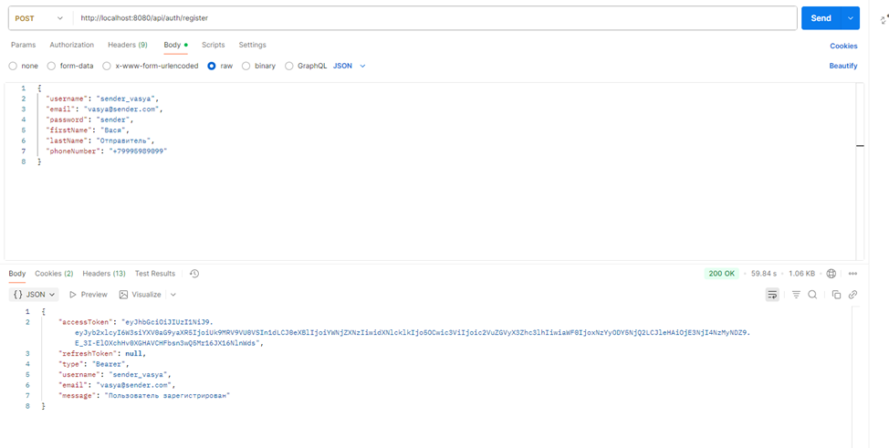
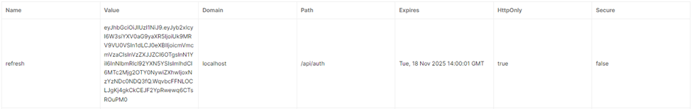

#### В куках и в редисе(выбрал редис, потому что токен будет автоматически удаляться по истечении expiration) -токены совпадают (рефреш токен храниться в HttpOnly-cookie), access-token передается в репспонсе.
#### 2. Демонстрация logout и login
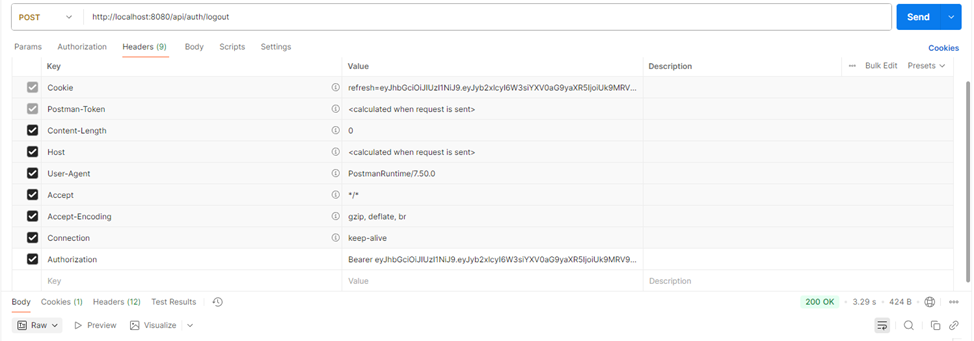
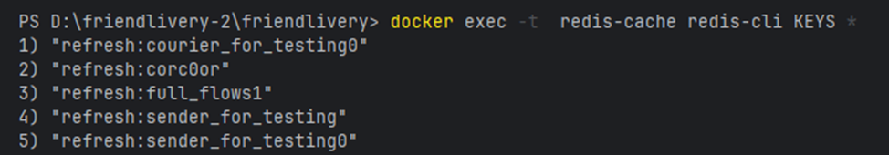
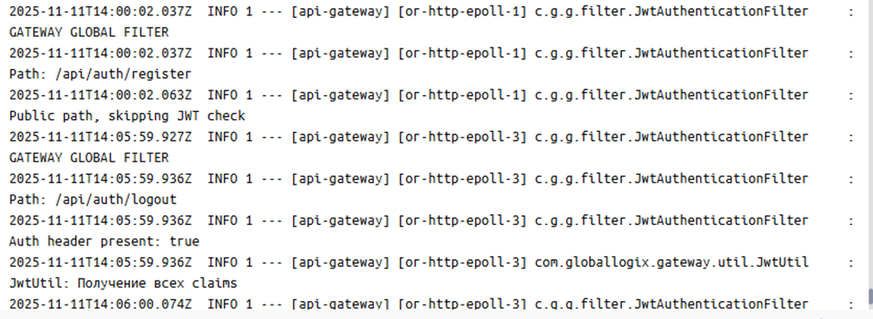
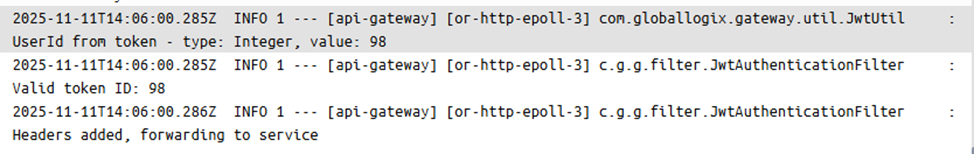

#### Аналогично запрос на регистрацию курьера и на создание rout (для проверки мэтчинга, при создании delivery проверяются все routes и нужным курьерам отправляется push, в хедере отправляем полученный access)
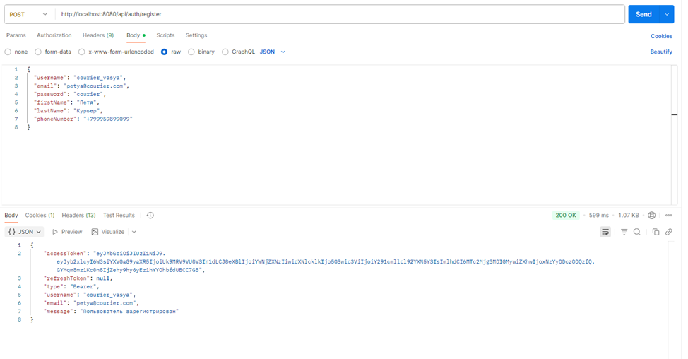
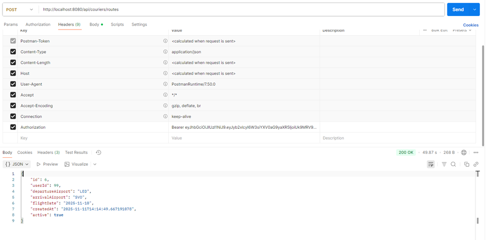
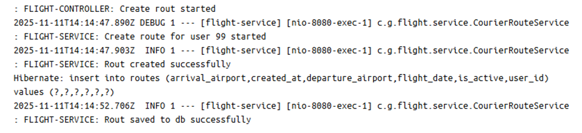
#### 3. Создание delivery и автоматический запуск мэтчинга через kafka
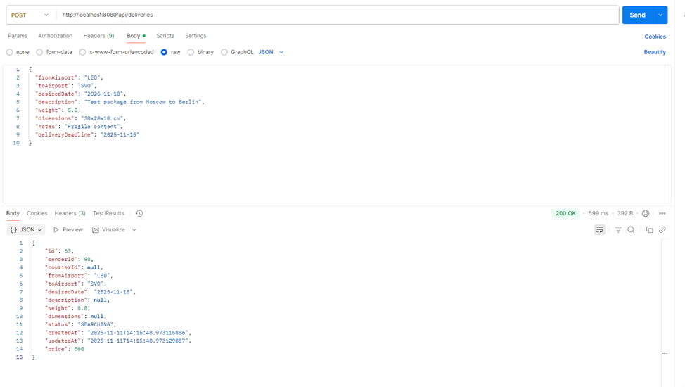
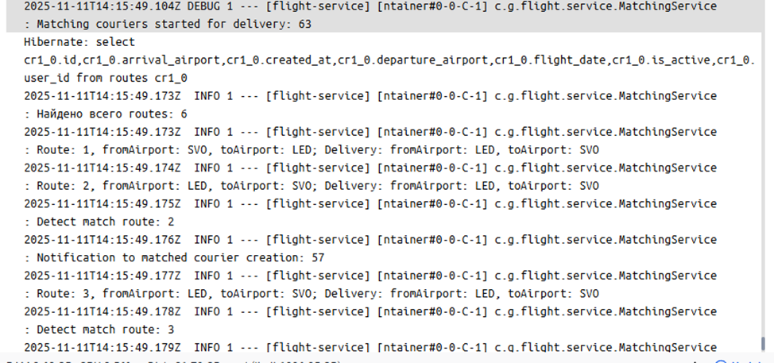
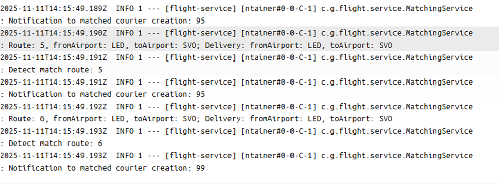   
#### 4. Принятие доставки курьером и создание чата между курьером и отправителем (delivery-service -> kafka -> chat-service)

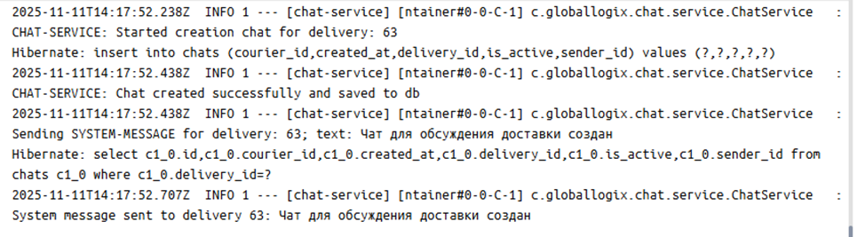
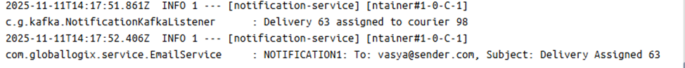
#### 5. Подтверждение передачи delivery курьеру и создание платежа (отправка ссылки на оплату на почту отправителю)
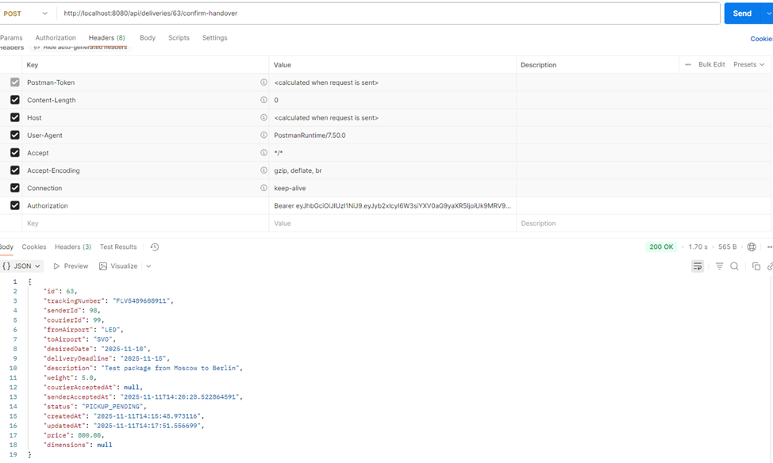
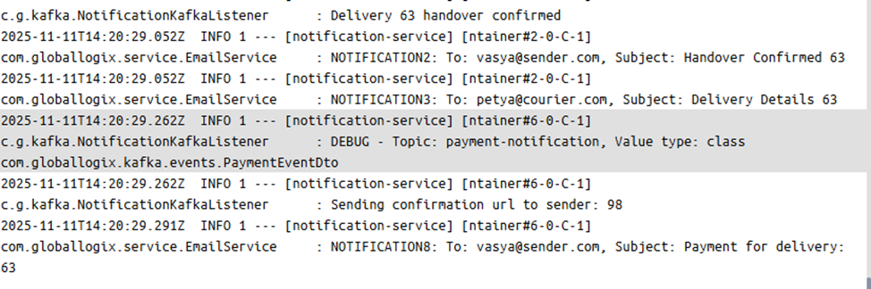
#### 6. Подтверждение получения delivery курьером
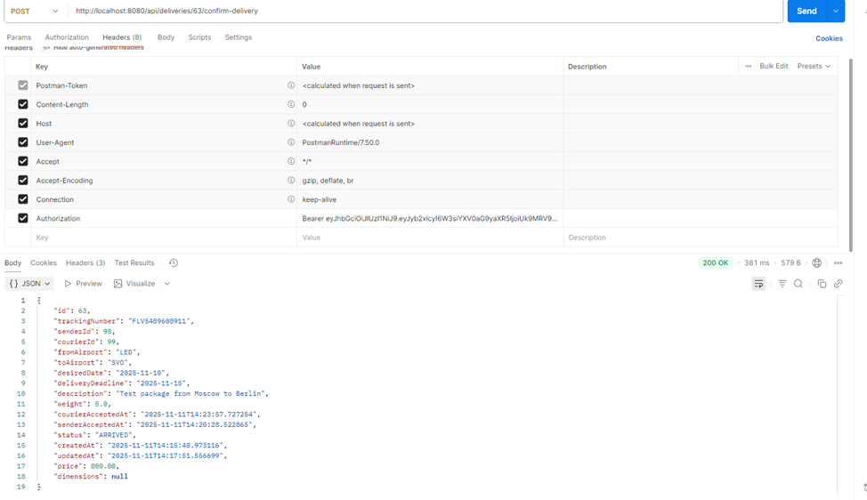
#### 7. Подтверждение курьером того, что delivery arrived

#### 8. Подтверждение отправителем передачи delivery получателю и изъятие денег со счета отправителя

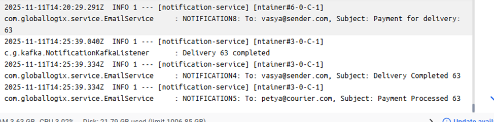
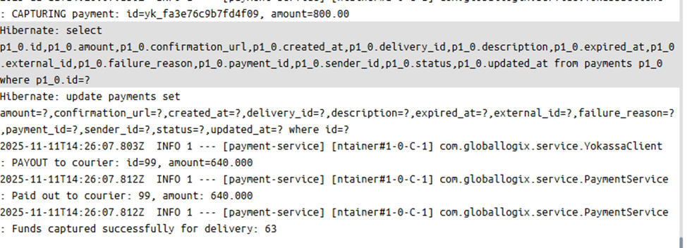

## 🎯 Планы по развитию

### 🔒 Безопасность и производительность
- **Rate Limiter в API Gateway** - защита от DDoS и ограничение количества запросов
- **Кэширование email в Redis** - ускорение доступа к email адресам в notification service (меньше запросов через feignclient в auth-service)
- **Продвинутые стратегии кэширования** - кэширование результатов мэтчинга и часто запрашиваемых данных

### 🧠 Умный мэтчинг и уведомления
- **Улучшенный подбор курьеров** - интеллектуальный мэтчинг на основ профиля курьера


### 📋 Документы и верификация
- **Загрузка документов** - система для верификации пользователей (доделать выгрузку)
- **Доставки только для verified пользователей**
- **KYC процесс** - полный цикл проверки идентичности

### 💳 Платежные системы и интеграции
- **Интеграция с реальными платежными системами** - замена мок-клиента ЮКасса на:

### ✈️ Авиа-интеграции
- **Интеграция с системами авиакомпаний** - автоматическая проверка билетов
- **Верификация бронирований** - автоматическая проверка действительности билетов

### 🛠️ DevOps и инфраструктура
- **CI/CD Pipeline** - автоматизация сборки, тестирования и деплоя
- **Мониторинг и логирование** - Prometheus, Grafana, централизованное логирование
- **Кластеризация** - Docker Swarm/Kubernetes для оркестрации
- **Health checks и метрики** - расширенный мониторинг состояния сервисов

### 💡 Дополнительные функции
- **Система рейтингов и отзывов** - для курьеров и отправителей
- **Геолокация** - трекинг доставок в реальном времени
- **Мультиязычность** - поддержка разных языков
- **Мобильное приложение** - React Native/iOS/Android клиенты
- **Админ-панель** - управление платформой и мониторинг
- **Аналитика и отчетность** - бизнес-метрики и статистика
