# Friendlivery - Платформа Доставки Посылок

> Объединение путешественников с пустующим местом в багаже и людей, которым нужна срочная доставка

## Оглавление
- [Идея проекта](#-идея-проекта)
- [Основной функционал](#-основной-функционал)
- [Архитектура](#-архитектура)
- [Технологический стек](#-технологический-стек)
- [Быстрый старт](#-быстрый-старт)
- [Демонстрация полного цикла](#-демонстрация-полного-цикла)

## Идея проекта

### Проблема двух сторон

**Со стороны путешественников:**
- Пассажиры авиарейсов часто летают с неполным багажом
- Включенные в билет килограммы остаются неиспользованными
- Потенциальный дополнительный доход упускается

**Со стороны отправителей:**
- Срочная доставка документов и мелких грузов стоит дорого
- Традиционные курьерские службы работают медленно (3-7 дней)
- Нет гарантий безопасной и быстрой доставки

### Решение

Friendlivery позволяет связать две группы пользователей


## Основной функционал

### Ролевая модель

**Курьер (Путешественник):**
- Указывает маршрут полета и даты вылета/прилета
- Определяет доступный вес и габариты багажа
- Просматривает подходящие заявки на доставку
- Выбирает заявку и связывается с отправителем
- Получает оплату после успешной доставки

**Отправитель:**
- Создает заявку с описанием груза
- Указывает аэропорты отправки и назначения
- Задает желаемые сроки доставки
- Вносит оплату
- Подтверждает получение груза


## Архитектура
**Delivery-Service** - основной сервис, ядро программы, отвечающий за смену статусов доставки, отправку основный событий kafka; интеграция с IP-API

### Backend 

**Auth-Service** - Аутентификация и авторизация  

**Delivery-Service** - Управление заявками на доставку

**Flight-Service** - Маршруты курьеров и мэтчинг  

**Payment-Service** - Платежи

**Chat-Service** - Коммуникация между пользователями  

**Notification-Service** - Уведомления

**API-Gateway** - Единая точка входа (маршрутизатор, проверка access-токена, добавление в заголовок userId из токена)


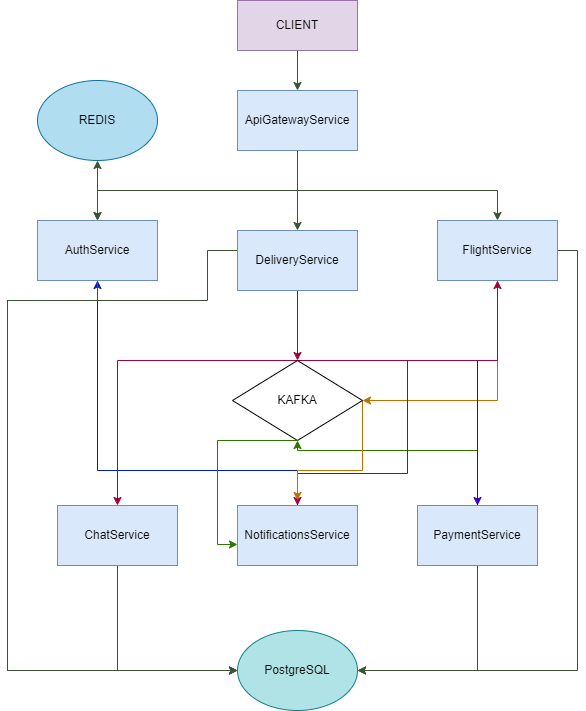
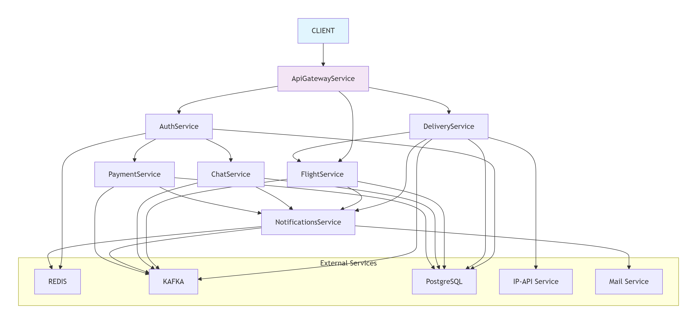
## Технологический стек

| Категория | Технологии |
|-----------|------------|
| **Backend** | Java 21, Spring Boot 3.4.5, Spring Security, Spring Data JPA, Spring Kafka, Spring Web, Spring Cloud OpenFeign |
| **Базы данных и кэширование** | PostgreSQL, Redis, Hibernate |
| **Инфраструктура** | Docker, Docker Compose, Apache Kafka, JWT |
| **Тестирование** | Mockito/JUnit 5 |
| **Документация** | Swagger, OpenAPI | 
| **Сборщик проектов** | Maven | 

## Быстрый старт
### Требования
- Java 21
- Maven 3.6+
- Docker & Docker Compose

### Запуск:

```bash
mvn clean package
docker-compose up -d
```

##  Демонстрация полного цикла
### Демонстрация работы интеграции с DaData (добавил после демонстрации полного цикла)
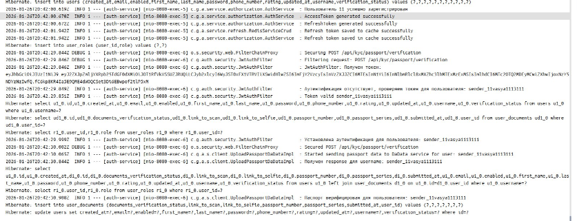
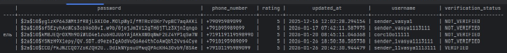
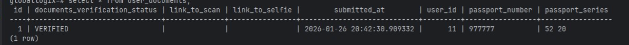
*В демо показан основной бизнес-процесс. Полная функциональность включает дополнительные сценарии.*
#### 1. Регистарция и аутентификаци
#### Cначала делаем запрос на регистрацию отправителя
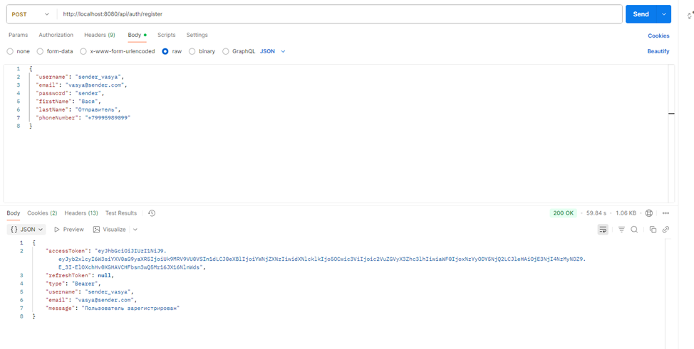
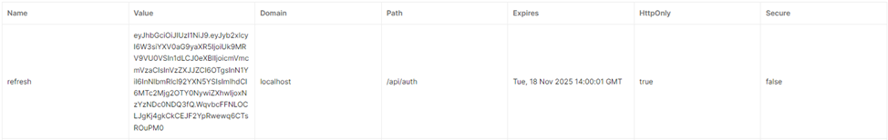
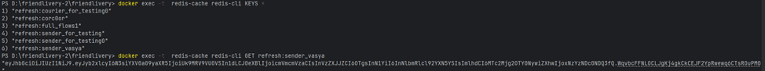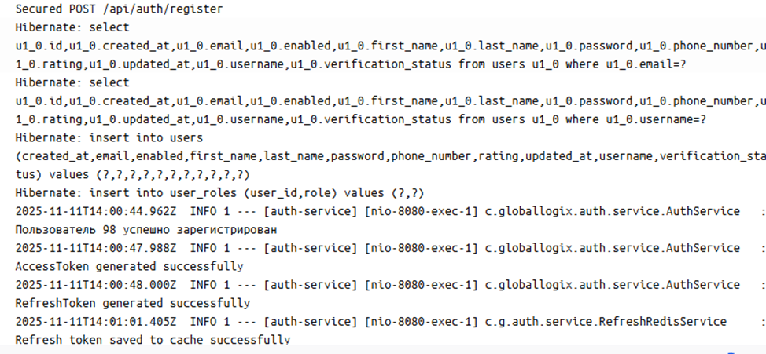
#### В куках и в редисе(выбрал редис, потому что токен будет автоматически удаляться по истечении expiration) -токены совпадают (рефреш токен храниться в HttpOnly-cookie), access-token передается в репспонсе.
#### 2. Демонстрация logout и login
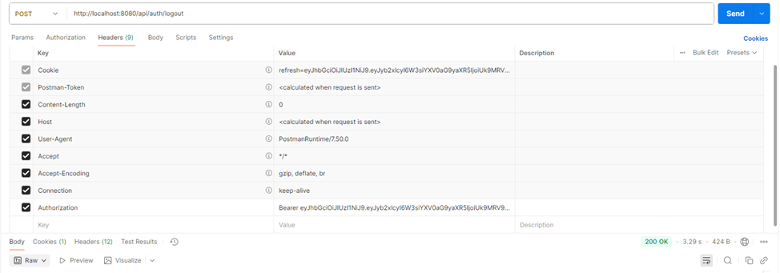
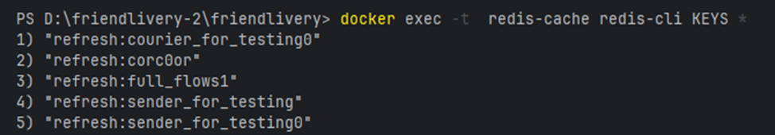
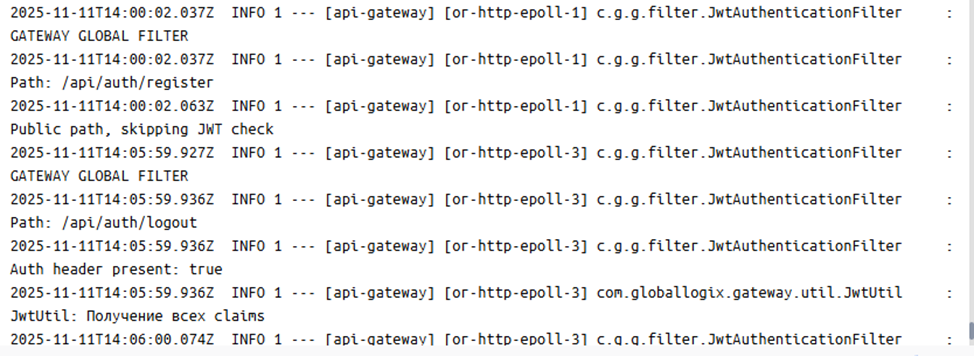
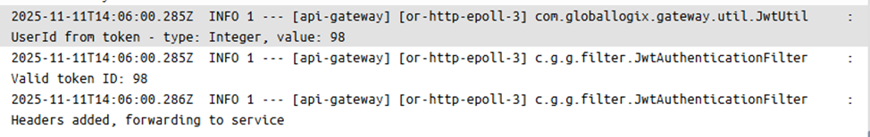
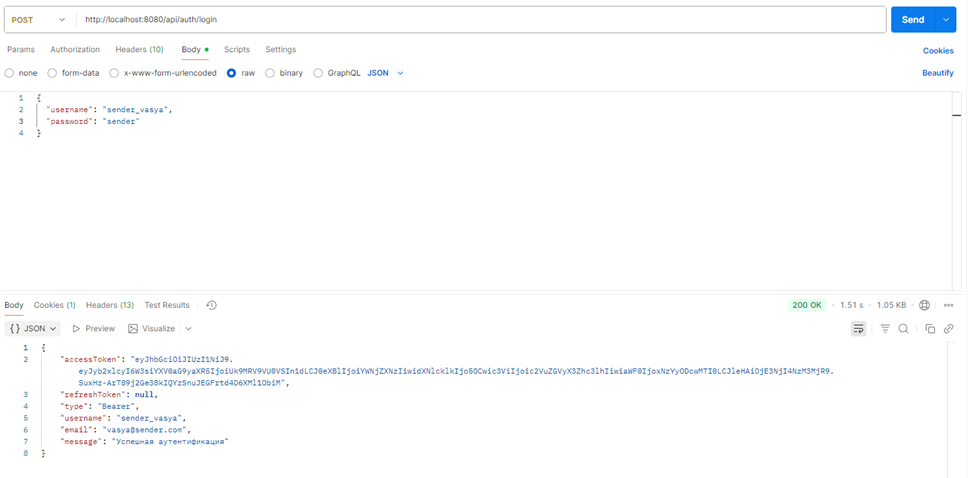
#### Аналогично запрос на регистрацию курьера и на создание rout (для проверки мэтчинга, при создании delivery проверяются все routes и нужным курьерам отправляется push, в хедере отправляем полученный access)
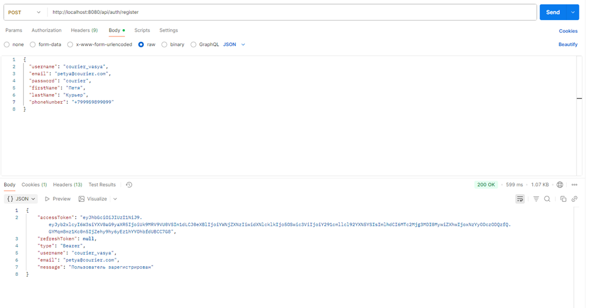
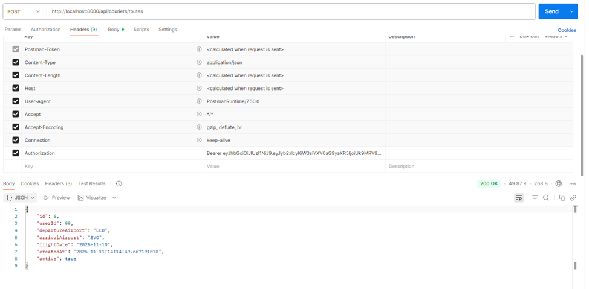
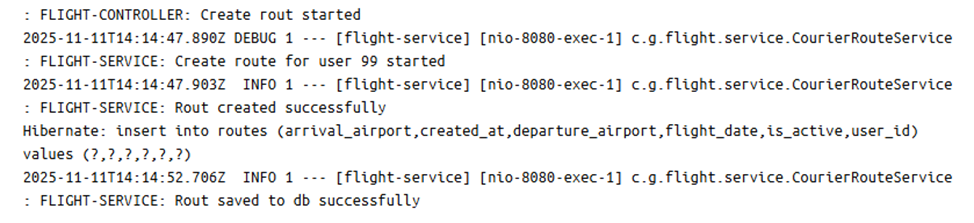
#### 3. Создание delivery и автоматический запуск мэтчинга через kafka
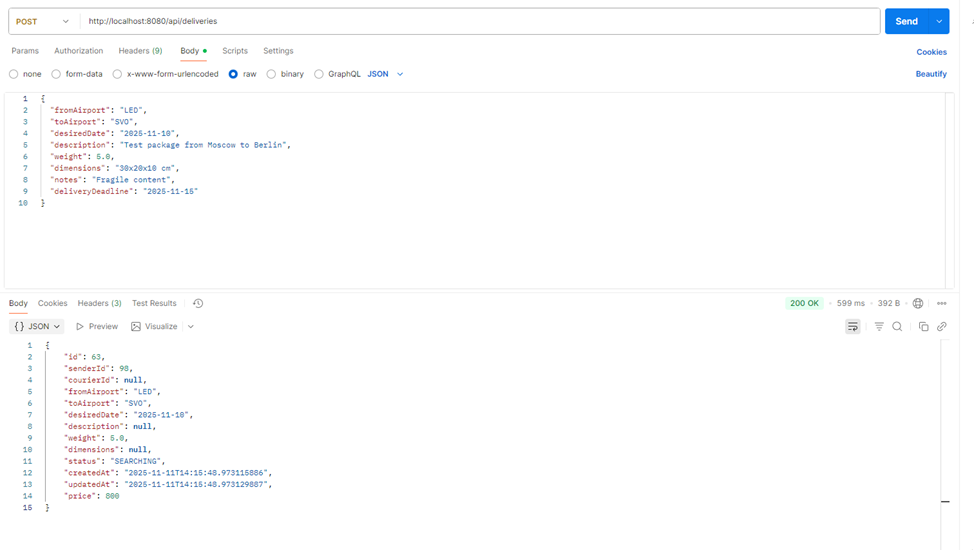
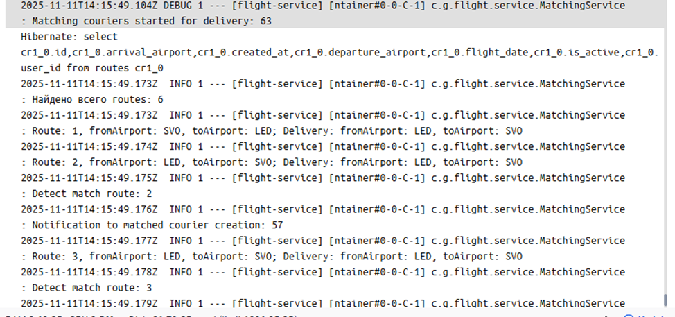
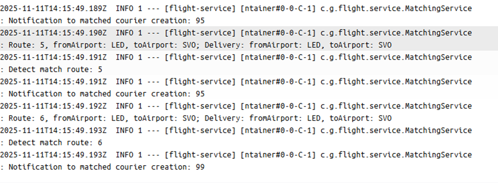   
#### 4. Принятие доставки курьером и создание чата между курьером и отправителем (delivery-service -> kafka -> chat-service)

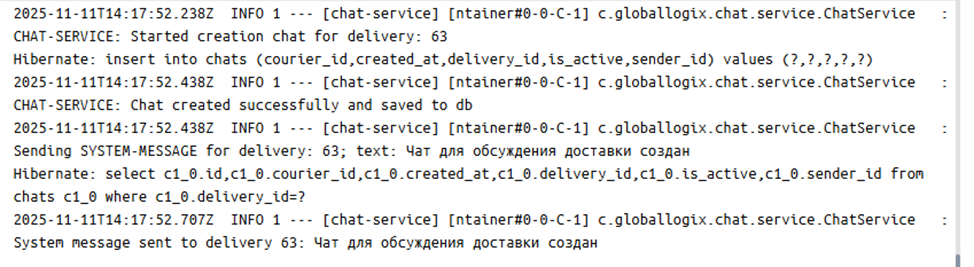
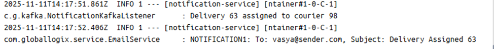
#### 5. Подтверждение передачи delivery курьеру и создание платежа (отправка ссылки на оплату на почту отправителю)
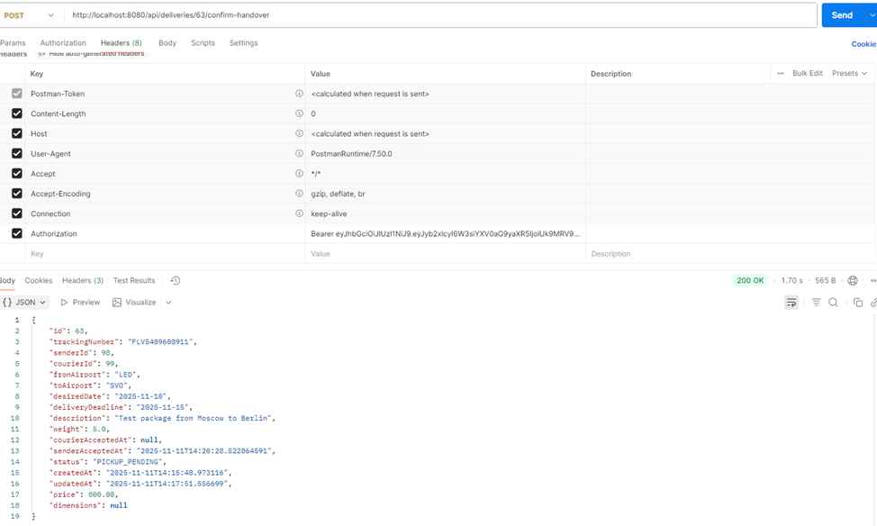
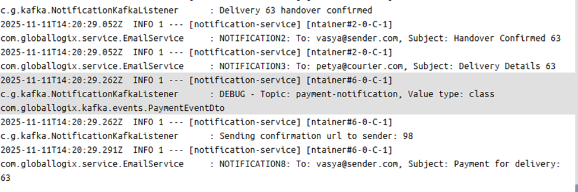
#### 6. Подтверждение получения delivery курьером

#### 7. Подтверждение курьером того, что delivery arrived
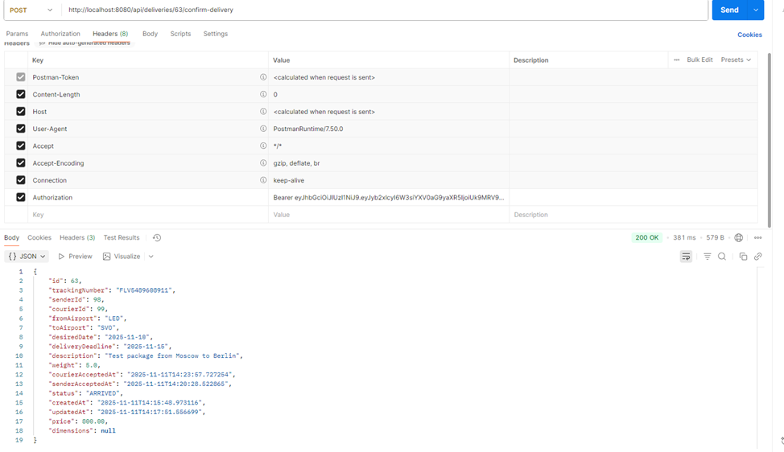
#### 8. Подтверждение отправителем передачи delivery получателю и изъятие денег со счета отправителя

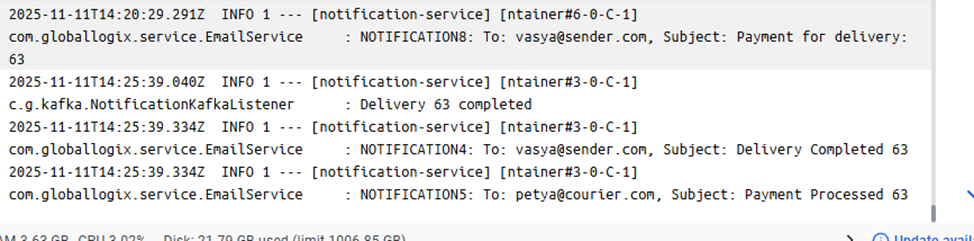
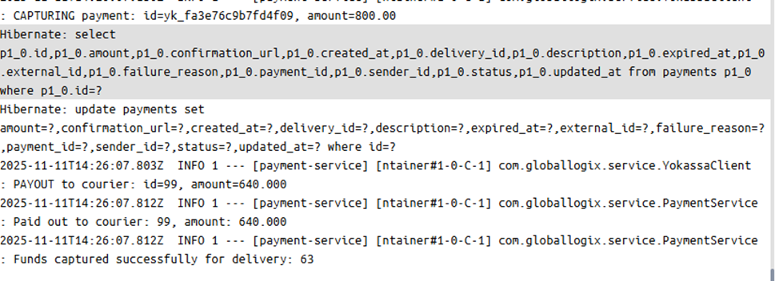
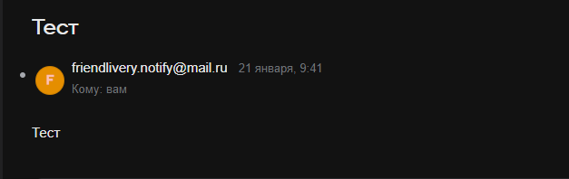
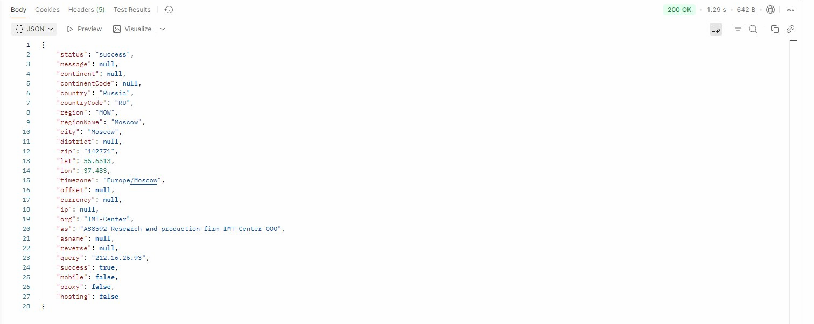
#### Для полной работы определения геолокации требуется добавить прокси для сохранения реального ip клиента (в docker-сети в api-gateway приходит ip docker-хоста)
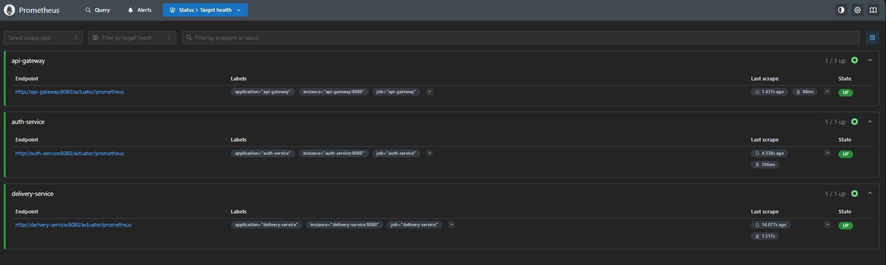

